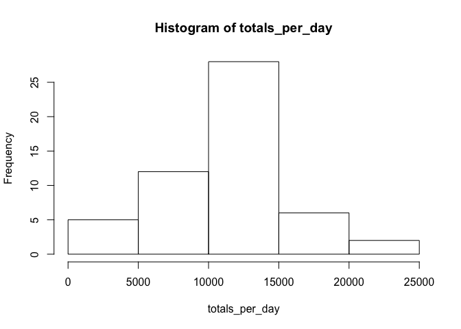
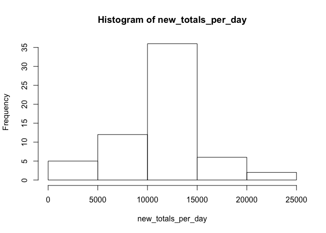
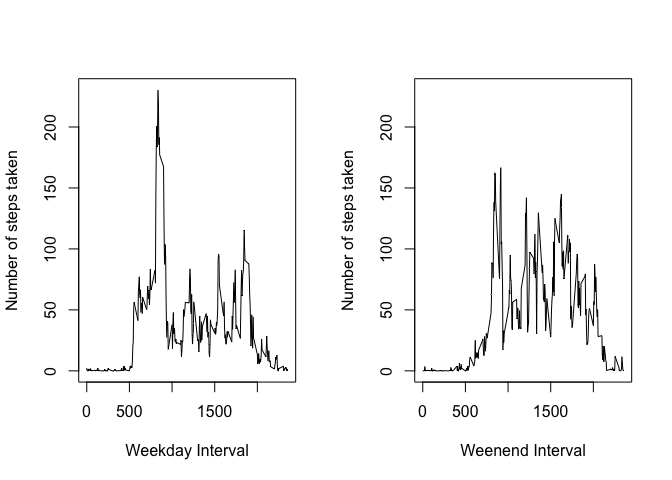

# Reproducible Research: Peer Assessment 1


## Loading and preprocessing the data

The activity data is contained within a CSV file: 


```r
x <- read.csv("activity.csv")
```

## What is mean total number of steps taken per day?

To do this we calculate the sum of the number of steps grouped by day.


```r
# Ignore the 'NA' values in the 'steps' column.
y <- x[!is.na(x$steps),]
z <- aggregate(steps ~ date, y, sum)
totals_per_day <- z[,2]
```

A histogram of this looks like:


```r
hist(totals_per_day)
```

<!-- -->

The mean and median of the total number of steps per day are:


```r
mean(totals_per_day)
```

```
## [1] 10766.19
```

```r
median(totals_per_day)
```

```
## [1] 10765
```

## What is the average daily activity pattern?

The daily activity pattern is a plot of the number of steps over time (or time-interval). Rather
than do this for every single day in the dataset, we take the average for each time interval
and plot that instead.


```r
# Group the activity by the interval and take the average number of steps
daily_activity <- aggregate(steps ~ interval, y, mean)
```


```r
plot(daily_activity, type="l")
```

<!-- -->

The 5-minute interval containing the maximum number of steps can be found by:


```r
daily_activity[daily_activity$steps==max(daily_activity$steps),]
```

```
##     interval    steps
## 104      835 206.1698
```

We see that it's the 104th interval number starting at 08:35 which has 206 steps.  

## Imputing missing values

The number of missing values (coded as NA) is calculated as follows:


```r
missing_values <-  x[is.na(x$steps),]
nrow(missing_values)
```

```
## [1] 2304
```

A simple strategy for filling in the missing values is to use the average for that time interval
for other days in the data set that do have values. The variable `daily_activity` already records
the average number of steps for time intervals for the rows in the dataset that do have values, so
we'll use this as the base for a new data set.

We can join the missing values to the averages using the `merge` R function: the common column in
both is `interval`:


```r
library(dplyr)
z <- select(merge(missing_values, daily_activity, by.x = 'interval', by.y = 'interval'), 
            steps=steps.y, date, interval)

imputed <- z[with(z, order(date, interval)),]
```

We can now use the `rbind` function to concatentate this with the `y` dataset to get a new dataset
with all values filled:


```r
new_data_set <- rbind(y, imputed)
```


```r
new_totals_per_day <- aggregate(steps ~ date, new_data_set, sum)[,2]
```

A histogram of the new data looks like:


```r
hist(new_totals_per_day)
```

<!-- -->

The mean and median of the new total number of steps per day are:


```r
mean(new_totals_per_day)
```

```
## [1] 10766.19
```

```r
median(new_totals_per_day)
```

```
## [1] 10766.19
```

As you can see from the results, the mean stays the same - this is expected, but the median changes and now has the same value of the mean. The total daily number of steps has increased.

## Are there differences in activity patterns between weekdays and weekends?

Let's create a new factor column in the new dataset to distinguish weekdays from weekends.


```r
weekends <- c('Saturday', 'Sunday')
new_data_set$week_or_weekend <- factor((weekdays(as.Date(new_data_set$date)) %in% weekends), 
         levels=c(TRUE, FALSE), labels=c('weekend', 'weekday'))
```

With this new column in place we can get the average number of steps taken for weekends or weekdays and 
make a side-by-side plot for comparison:


```r
weekday_daily_activity <- aggregate(steps ~ interval, 
                                    new_data_set[new_data_set$week_or_weekend=='weekday',], mean)
weekend_daily_activity <- aggregate(steps ~ interval, 
                                    new_data_set[new_data_set$week_or_weekend=='weekend',], mean)

# When making the two graphs, ensure that the y-axis limits are the same for easier comparison.
ylim <- range(weekday_daily_activity$steps)

par(mfrow=c(1, 2))
plot(weekday_daily_activity, type="l", 
     xlab="Weekday Interval", 
     ylab="Number of steps taken",
     ylim=ylim)
plot(weekend_daily_activity, type="l", 
     xlab="Weenend Interval", 
     ylab="Number of steps taken",
     ylim=ylim)
```

<!-- -->

From the plots we can see that there's a big difference in activity between weekdays and weekends:

* Weekdays show high periods of activity early in the morning, with less activity during the day.
* Weekends show a wider range of activity during the day.
